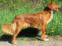

# image-proccessing (BMP photo editor)
## What you can do in this editor?
- compress or expand photo size
- inverse colors
- blur photo
- sepia
- detect shapes (enter (x,y) position of origin shape pixel and colors difference toleration)

## Original photo   

### Compressing photo (5:1 in this ex.)   

### Inversing colors   

### Blur   

### Sepia   

### Detecting shapes   

### Drawing contours in image

### Lines detecting

